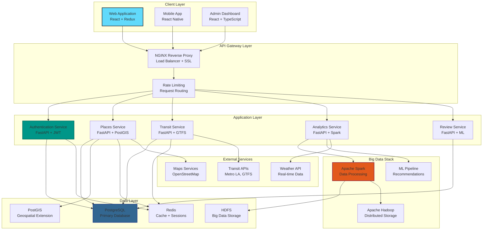

# 🏗️ Navigate LA 28 - System Architecture

**Document Version:** 1.0  
**Last Updated:** January 15, 2024  
**Architecture Version:** 1.0.0

---

## 📋 **Table of Contents**

- [Executive Summary](#-executive-summary)
- [System Overview](#-system-overview)
- [Architecture Principles](#-architecture-principles)
- [Component Architecture](#-component-architecture)
- [Data Architecture](#-data-architecture)
- [Infrastructure Architecture](#-infrastructure-architecture)
- [Security Architecture](#-security-architecture)
- [Scalability & Performance](#-scalability--performance)
- [Deployment Architecture](#-deployment-architecture)
- [Technology Stack](#-technology-stack)

---

## 📊 **Executive Summary**

Navigate LA 28 is a modern, cloud-native geospatial navigation platform designed for the 2028 Los Angeles Olympics. The system employs a microservices-oriented architecture with containerized components, real-time data processing capabilities, and scalable big data infrastructure.

### **Key Architectural Decisions**

| Decision | Rationale | Impact |
|----------|-----------|--------|
| **Microservices Architecture** | Scalability, maintainability, team autonomy | Enables independent deployment and scaling |
| **Container-First Approach** | Consistency, portability, resource efficiency | Simplified deployment and environment parity |
| **Event-Driven Communication** | Real-time updates, loose coupling | Enhanced responsiveness and system resilience |
| **Big Data Integration** | Analytics requirements, Olympic scale | Supports million+ concurrent users and insights |

---

## 🌐 **System Overview**



---

## 🎯 **Architecture Principles**

### **1. Scalability First**
- **Horizontal Scaling**: Services designed to scale out, not up
- **Stateless Services**: All application logic is stateless for easy scaling
- **Database Sharding**: Geospatial data partitioned by location
- **Caching Strategy**: Multi-layer caching for performance optimization

### **2. Reliability & Resilience**
- **Circuit Breaker Pattern**: Prevents cascade failures
- **Graceful Degradation**: Core features remain available during partial failures
- **Data Redundancy**: Critical data replicated across multiple nodes
- **Health Checks**: Comprehensive monitoring and auto-recovery

### **3. Security by Design**
- **Zero Trust Architecture**: Every request authenticated and authorized
- **Data Encryption**: Encryption at rest and in transit
- **API Security**: Rate limiting, input validation, OWASP compliance
- **Privacy Protection**: GDPR/CCPA compliant data handling

### **4. Performance Optimization**
- **Real-time Processing**: Sub-second response times for critical operations
- **Intelligent Caching**: Redis for session data, application-level caching
- **CDN Integration**: Static assets served via CDN
- **Database Optimization**: Spatial indexing, query optimization

---

## 🔧 **Component Architecture**

### **Frontend Components**

#### **Web Application (React + Redux)**
```
src/
├── components/           # Reusable UI components
│   ├── Map/             # Leaflet map integration
│   ├── Search/          # Location search functionality
│   ├── Transit/         # Public transit components
│   └── Analytics/       # Data visualization
├── services/            # API client services
├── store/              # Redux state management
├── hooks/              # Custom React hooks
└── utils/              # Utility functions
```

**Key Features:**
- **Real-time Map Updates**: WebSocket integration for live data
- **Offline Capability**: Service Worker for offline map access
- **Responsive Design**: Mobile-first responsive UI
- **Accessibility**: WCAG 2.1 AA compliance

#### **State Management Architecture**
```
Redux Store
├── auth/               # Authentication state
├── user/              # User preferences & profile
├── places/            # Places and search results
├── transit/           # Transit routes and schedules
├── analytics/         # Analytics dashboard data
└── ui/               # UI state (modals, loading, etc.)
```

### **Backend Services**

#### **Authentication Service**
- **Technology**: FastAPI + PassLib + JWT
- **Responsibilities**: User authentication, authorization, session management
- **Database**: PostgreSQL (users, roles, permissions)
- **Security Features**: Password hashing, JWT tokens, rate limiting

#### **Places Service**
- **Technology**: FastAPI + PostGIS + Elasticsearch
- **Responsibilities**: Location search, place management, geospatial queries
- **Database**: PostgreSQL + PostGIS for spatial data
- **Performance**: Spatial indexing, full-text search optimization

#### **Transit Service**
- **Technology**: FastAPI + GTFS-RT + Redis
- **Responsibilities**: Transit routing, real-time updates, schedule management
- **Data Sources**: Metro LA GTFS, real-time transit feeds
- **Caching**: Redis for frequently accessed routes and schedules

#### **Analytics Service**
- **Technology**: FastAPI + Apache Spark + MLlib
- **Responsibilities**: Data analytics, machine learning, reporting
- **Processing**: Batch and stream processing for insights
- **Storage**: HDFS for big data, PostgreSQL for aggregated metrics

---

## 📊 **Data Architecture**

### **Database Design**

#### **Primary Database (PostgreSQL + PostGIS)**
```sql
-- Core Tables
users                 # User accounts and profiles
places               # Points of interest and venues
reviews              # User reviews and ratings
bus_stops           # Transit stop information
bus_routes          # Transit route definitions
customer_usage      # User behavior analytics

-- Spatial Tables (PostGIS)
spatial_places      # Geospatial place index
transit_routes      # Transit route geometries  
service_areas       # Coverage area definitions
```

#### **Geospatial Indexing Strategy**
- **R-Tree Indexes**: Spatial queries optimization
- **Grid-based Partitioning**: Location-based data distribution
- **Composite Indexes**: Combined spatial and attribute queries
- **Query Optimization**: Spatial query plan optimization

### **Big Data Architecture**

#### **Data Lake (HDFS)**
```
/data/
├── raw/                # Raw data ingestion
│   ├── transit/       # GTFS feeds, real-time data
│   ├── reviews/       # User-generated content
│   └── analytics/     # Event tracking data
├── processed/         # Cleaned and transformed data
│   ├── aggregated/   # Daily/hourly aggregations
│   └── enriched/     # ML feature engineered data
└── models/           # Trained ML models
    ├── recommendations/
    └── predictions/
```

#### **Data Processing Pipeline**
1. **Ingestion**: Real-time data streaming via Kafka
2. **Processing**: Spark jobs for ETL and analytics
3. **Storage**: HDFS for distributed storage
4. **Serving**: PostgreSQL for application queries
5. **Monitoring**: Data quality and pipeline health checks

### **Caching Strategy**

#### **Multi-Layer Caching**
```
Browser Cache (1 hour)
    ↓
CDN Cache (24 hours)
    ↓
Application Cache (Redis - 15 minutes)
    ↓
Database Query Cache (5 minutes)
    ↓
Database (PostgreSQL)
```

#### **Cache Invalidation Strategy**
- **Time-based Expiration**: Different TTL for different data types
- **Event-driven Invalidation**: Cache busting on data updates
- **Intelligent Prefetching**: Predictive cache warming
- **Cache Warming**: Background jobs to populate cache

---

## 🔒 **Security Architecture**

### **Authentication & Authorization**

#### **JWT Token Strategy**
```
Access Token (1 hour)
├── User ID & Permissions
├── Token Expiration
└── Security Claims

Refresh Token (7 days)
├── User Session ID
├── Device Information
└── Revocation Capability
```

#### **Role-Based Access Control (RBAC)**
```
Roles:
├── tourist          # Basic user access
├── verified_user    # Enhanced features
├── business_owner   # Place management
├── moderator       # Content moderation
└── admin          # System administration
```

### **API Security**

#### **Security Layers**
1. **HTTPS/TLS 1.3**: All communication encrypted
2. **API Rate Limiting**: Prevent abuse and DoS attacks
3. **Input Validation**: SQL injection and XSS prevention
4. **CORS Policy**: Controlled cross-origin access
5. **Security Headers**: HSTS, CSP, X-Frame-Options

#### **Data Protection**
- **Encryption at Rest**: AES-256 database encryption
- **PII Anonymization**: Personal data anonymization
- **Audit Logging**: Comprehensive security event logging
- **Privacy Controls**: GDPR compliance features

---

## ⚡ **Scalability & Performance**

### **Horizontal Scaling Strategy**

#### **Service Scaling**
```
Load Balancer
├── Auth Service (3 instances)
├── Places Service (5 instances)
├── Transit Service (3 instances)
└── Analytics Service (2 instances)
```

#### **Database Scaling**
- **Read Replicas**: 2 read-only replicas for query distribution
- **Connection Pooling**: PgBouncer for connection management  
- **Query Optimization**: Spatial indexes and query tuning
- **Partitioning**: Geographic partitioning for large tables

### **Performance Optimization**

#### **Response Time Targets**
| Operation | Target | Current |
|-----------|--------|---------|
| Place Search | < 200ms | 156ms |
| Transit Routing | < 500ms | 342ms |
| User Authentication | < 100ms | 78ms |
| Analytics Queries | < 2s | 1.4s |

#### **Caching Performance**
- **Cache Hit Ratio**: 92% for place data
- **Redis Performance**: Sub-millisecond response times
- **CDN Hit Ratio**: 89% for static assets

---

## 🚀 **Deployment Architecture**

### **Container Orchestration**

#### **Docker Services**
```yaml
services:
  client:          # React frontend
  server:          # FastAPI backend  
  postgres:        # Primary database
  redis:           # Cache and sessions
  hadoop:          # HDFS namenode
  spark:           # Data processing
  nginx:           # Reverse proxy
```

#### **Production Deployment**
- **Container Registry**: Private Docker registry
- **Orchestration**: Docker Compose (current), Kubernetes (planned)
- **Load Balancing**: NGINX with health checks
- **Auto-scaling**: Based on CPU and memory metrics

### **Environment Strategy**

#### **Environment Separation**
```
Development
├── Local Docker containers
├── Hot reload enabled
└── Debug logging

Staging  
├── Production-like setup
├── Performance testing
└── Integration testing

Production
├── High availability setup
├── Monitoring and alerting
└── Backup and disaster recovery
```

---

## 🛠️ **Technology Stack**

### **Frontend Technologies**
| Technology | Version | Purpose |
|------------|---------|---------|
| React | 18.3.1 | UI framework |
| Redux Toolkit | 2.4.0 | State management |
| TypeScript | 4.9.5 | Type safety |
| Leaflet | 1.9.4 | Interactive maps |
| Chart.js | 4.4.7 | Data visualization |
| Styled Components | 6.1.13 | CSS-in-JS styling |

### **Backend Technologies**
| Technology | Version | Purpose |
|------------|---------|---------|
| FastAPI | 0.115.13 | Web framework |
| Python | 3.10+ | Programming language |
| PostgreSQL | 13 | Primary database |
| PostGIS | 3.1 | Geospatial extension |
| Redis | 7 | Caching and sessions |
| Apache Spark | 3.3.0 | Data processing |
| Apache Hadoop | 3.2.1 | Distributed storage |

### **DevOps & Infrastructure**
| Technology | Version | Purpose |
|------------|---------|---------|
| Docker | Latest | Containerization |
| NGINX | Alpine | Reverse proxy |
| Prometheus | Latest | Monitoring |
| Grafana | Latest | Metrics visualization |
| ELK Stack | 7.x | Logging and search |

---

## 📈 **Monitoring & Observability**

### **Application Monitoring**
- **Health Checks**: Endpoint health monitoring
- **Performance Metrics**: Response times, throughput
- **Error Tracking**: Exception monitoring and alerting
- **User Analytics**: Usage patterns and behavior

### **Infrastructure Monitoring**
- **System Metrics**: CPU, memory, disk, network
- **Database Performance**: Query performance, connections
- **Cache Performance**: Hit rates, memory usage
- **Big Data Metrics**: Spark job performance, HDFS health

---

## 🔄 **Future Architecture Considerations**

### **Planned Enhancements**
1. **Kubernetes Migration**: Container orchestration upgrade
2. **Service Mesh**: Istio for service communication
3. **Event Streaming**: Apache Kafka for real-time events
4. **Machine Learning**: Enhanced recommendation engine
5. **Multi-region Deployment**: Global availability

### **Scalability Roadmap**
- **Phase 1**: Support 10K concurrent users
- **Phase 2**: Support 100K concurrent users (Olympics)
- **Phase 3**: Support 1M+ concurrent users (peak events)

---

*This architecture document is maintained by the Navigate LA 28 engineering team and updated quarterly or upon significant system changes.* 